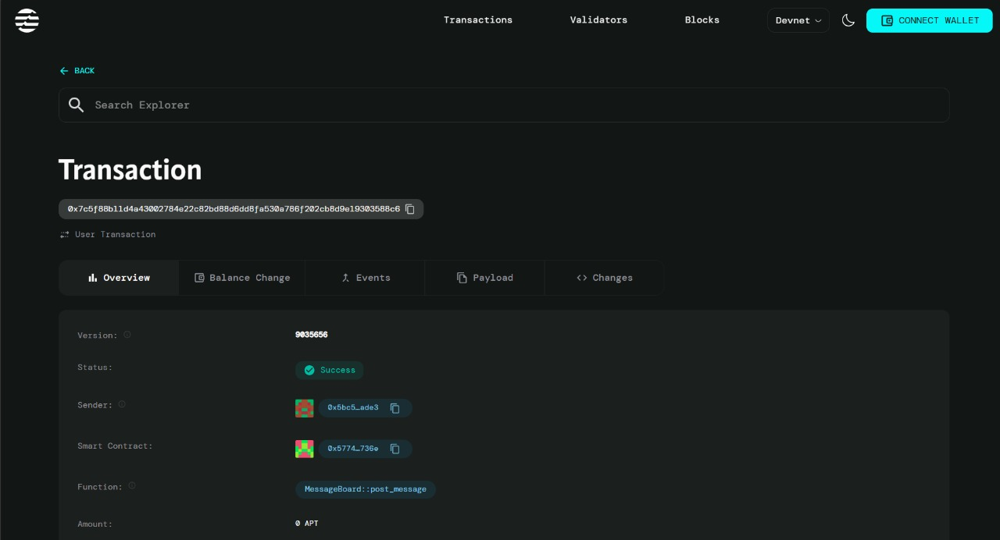

# 📝 Decentralized Message Board on Aptos

A fully decentralized message board built on the Aptos blockchain using Move smart contracts and React with Vite. Anyone can post messages that are permanently stored on-chain, creating a censorship-resistant public bulletin board.


## 🌟 Features

- **🔗 Fully Decentralized**: All messages stored permanently on the Aptos blockchain
- **👥 Public Participation**: Anyone with a wallet can post messages
- **⏰ Timestamped Messages**: Every message includes author address and timestamp
- **💼 Petra Wallet Integration**: Seamless wallet connection experience
- **♻️ Real-time Updates**: Auto-refresh to display latest messages
- **🎨 Modern UI**: Beautiful gradient design with Tailwind CSS
- **⚡ Fast & Efficient**: Built with Vite for optimal performance

## 🏗️ Architecture

### Smart Contract (Move)
- **Module**: `MessageBoard`
- **Storage**: Board resource stores all messages in a vector
- **Functions**:
  - `initialize_board()` - Creates the message board
  - `post_message()` - Posts a new message (public access)
  - `get_messages()` - Retrieves all messages (view function)
  - `get_message_count()` - Returns total message count (view function)

### Frontend (React + TypeScript)
- **Framework**: React 18 with TypeScript
- **Build Tool**: Vite
- **Styling**: Tailwind CSS
- **Wallet**: Petra Wallet Adapter
- **Blockchain SDK**: Aptos TypeScript SDK

## 📂 Project Structure

```
decentralized-message-board/
├── sire/                           # Move smart contract
│   ├── sources/
│   │   └── MessageBoard.move      # Main smart contract
│   ├── Move.toml                  # Move package configuration
│   └── build/                     # Compiled contract (generated)
├── frontend/                       # React frontend
│   ├── src/
│   │   ├── App.tsx                # Main application component
│   │   ├── main.tsx               # Application entry point
│   │   └── index.css              # Global styles
│   ├── index.html                 # HTML template
│   ├── package.json               # Node dependencies
│   ├── vite.config.ts             # Vite configuration
│   ├── tailwind.config.js         # Tailwind configuration
│   └── tsconfig.json              # TypeScript configuration
├── .gitignore                     # Git ignore file
└── README.md                      # This file
```

## 📋 Prerequisites

Before you begin, ensure you have the following installed:

- **Node.js** (v16 or higher) - [Download](https://nodejs.org/)
- **npm** or **yarn** - Comes with Node.js
- **Aptos CLI** - [Installation Guide](https://aptos.dev/tools/aptos-cli/install-cli/)
- **Petra Wallet** - [Chrome Extension](https://petra.app/)
- **Git** - [Download](https://git-scm.com/)

## 🚀 Installation & Setup

### Step 1: Clone the Repository

```bash
git clone https://github.com/YOUR_USERNAME/decentralized-message-board.git
cd decentralized-message-board
```

### Step 2: Setup Aptos CLI

```bash
# Initialize Aptos CLI (first time only)
aptos init

# Select 'devnet' when prompted
# This will create a new account and save credentials in .aptos/config.yaml
```

### Step 3: Fund Your Account

```bash
# Get test APT tokens from the faucet
aptos account fund-with-faucet --account default
```

### Step 4: Deploy the Smart Contract

```bash
# Navigate to the Move contract directory
cd sire

# Compile the contract
aptos move compile --named-addresses sire=default

# Deploy to devnet
aptos move publish --named-addresses sire=default

# Type 'yes' when prompted to confirm the transaction
```

**Important**: Save the deployed contract address! You'll need it for the frontend.

### Step 5: Setup Frontend

```bash
# Navigate to frontend directory
cd ../frontend

# Install dependencies
npm install
```

### Step 6: Configure the Frontend

Open `frontend/src/App.tsx` and update the `MODULE_ADDRESS`:

```typescript
const MODULE_ADDRESS = "YOUR_DEPLOYED_CONTRACT_ADDRESS"; // Replace with your actual address
```

### Step 7: Import Account to Petra Wallet

To interact with the deployed contract:

1. Open your `.aptos/config.yaml` file
2. Copy the `private_key` value (starts with `0x...`)
3. Open Petra Wallet extension
4. Click account icon → "Add Account" → "Import Private Key"
5. Paste your private key and import
6. Switch to this account in Petra

### Step 8: Run the Application

```bash
# Start the development server
npm run dev

# Open http://localhost:5173 in your browser
```

## 🎮 Usage Guide

### For the Board Owner (First Time Setup)

1. **Connect Wallet**: Click "Connect Wallet" and select Petra
2. **Initialize Board**: Click "Initialize Message Board" button
3. **Approve Transaction**: Confirm in Petra wallet
4. **Wait for Confirmation**: Board will be ready in a few seconds

### For All Users (Posting Messages)

1. **Connect Wallet**: Any user connects their Petra wallet
2. **Write Message**: Type your message in the text field
3. **Post Message**: Click "Post" button
4. **Approve Transaction**: Confirm in Petra wallet (pays gas fee)
5. **View Message**: Your message appears with your address and timestamp

### Reading Messages

- Messages automatically refresh every 10 seconds
- Click "🔄 Refresh" to manually update
- Messages show author address and timestamp
- Newest messages appear at the top

## 🔧 Smart Contract Functions

### Entry Functions (Require Wallet Signature)

#### `initialize_board(account: &signer)`
- **Purpose**: Creates a new message board
- **Access**: Only callable once per account
- **Who Can Call**: Board owner only
- **Gas**: Paid by caller

#### `post_message(account: &signer, board_owner: address, content: String)`
- **Purpose**: Posts a message to the board
- **Access**: Anyone with a wallet
- **Parameters**:
  - `account`: The message author (automatically filled)
  - `board_owner`: Address where board is deployed
  - `content`: Message text
- **Gas**: Paid by message author

### View Functions (No Wallet Required)

#### `get_messages(board_owner: address): vector<Message>`
- **Purpose**: Retrieves all messages from the board
- **Returns**: Array of Message structs
- **Gas**: Free (read-only)

#### `get_message_count(board_owner: address): u64`
- **Purpose**: Gets total number of messages
- **Returns**: Number of messages
- **Gas**: Free (read-only)

## 🔐 How It Works

### Decentralized Architecture

1. **Board Storage**: The message board is stored as a resource on the deployer's account
2. **Message Posting**: Anyone can post by calling `post_message()` with:
   - Their wallet signature (proves authorship)
   - The board owner's address (where to post)
   - The message content
3. **Data Retrieval**: Messages are retrieved using view functions (no gas cost)
4. **Immutability**: Once posted, messages cannot be edited or deleted

### Gas Fees

- **Initialize Board**: Paid by board owner (one-time, ~0.001 APT)
- **Post Message**: Paid by message author (per message, ~0.0001 APT)
- **Read Messages**: Free (view functions don't cost gas)

### Security Features

- Messages are signed by the author's wallet (authenticity guaranteed)
- On-chain storage ensures permanence and censorship-resistance
- Public viewing ensures transparency
- No centralized server or database

## 🌐 Network Configuration

### Current Network: Aptos Devnet

```typescript
const NODE_URL = "https://fullnode.devnet.aptoslabs.com/v1";
```

### Switching Networks

To deploy on testnet or mainnet:

1. **Update App.tsx**:
```typescript
// For Testnet
const NODE_URL = "https://fullnode.testnet.aptoslabs.com/v1";

// For Mainnet
const NODE_URL = "https://fullnode.mainnet.aptoslabs.com/v1";
```

2. **Initialize Aptos CLI for the target network**:
```bash
aptos init --network testnet
# or
aptos init --network mainnet
```

3. **Deploy contract to the new network**:
```bash
aptos move publish --named-addresses sire=default
```

## 🛠️ Development

### Build for Production

```bash
cd frontend
npm run build
```

### Preview Production Build

```bash
npm run preview
```

### Run Tests (Move Contract)

```bash
cd sire
aptos move test
```

### Code Formatting

```bash
# Format frontend code
cd frontend
npm run format  # if configured in package.json
```

## 🐛 Troubleshooting

### Issue: "Message board not initialized" warning persists

**Solution**: 
- Ensure contract is deployed: `curl https://fullnode.devnet.aptoslabs.com/v1/accounts/YOUR_ADDRESS/modules`
- Check if you're using the same account in Petra and Aptos CLI
- Click "Initialize Message Board" and approve the transaction

### Issue: "Failed to initialize board: PetraApiError"

**Solution**:
- Make sure Petra wallet is connected to Devnet
- Ensure you have sufficient APT tokens: `aptos account fund-with-faucet --account default`
- Check that MODULE_ADDRESS in App.tsx matches your deployed contract

### Issue: Wallet not connecting

**Solution**:
- Install Petra wallet from [petra.app](https://petra.app/)
- Refresh the page
- Try disconnecting and reconnecting
- Clear browser cache if needed

### Issue: 404 errors in console

**Solution**:
- This is normal before initialization
- After clicking "Initialize Message Board", 404s should only appear briefly
- If persistent, verify contract deployment

### Issue: Transaction fails

**Solution**:
- Check wallet has enough APT for gas
- Ensure you're on the correct network (Devnet)
- Wait a few seconds and try again
- Check Aptos Explorer for transaction status

## 📊 Project Stats

- **Smart Contract**: ~50 lines of Move code
- **Frontend**: React + TypeScript
- **Total Dependencies**: Minimal (security-focused)
- **Gas Costs**: 
  - Initialize: ~0.001 APT
  - Post Message: ~0.0001 APT
  - Read Messages: Free

## 🔗 Useful Links

- [Aptos Documentation](https://aptos.dev)
- [Move Language Book](https://move-language.github.io/move/)
- [Petra Wallet](https://petra.app/)
- [Aptos Explorer (Devnet)](https://explorer.aptoslabs.com/?network=devnet)
- [Aptos Faucet](https://aptoslabs.com/testnet-faucet)
- [Aptos Discord](https://discord.gg/aptoslabs)

## 🤝 Contributing

Contributions are welcome! Here's how you can help:

1. Fork the repository
2. Create a feature branch (`git checkout -b feature/amazing-feature`)
3. Commit your changes (`git commit -m 'Add amazing feature'`)
4. Push to the branch (`git push origin feature/amazing-feature`)
5. Open a Pull Request

### Ideas for Contributions

- Add message reactions/likes
- Implement message categories/tags
- Add user profiles
- Create message search functionality
- Add image/media support
- Implement message threading
- Add moderation features
- Multi-language support


## 🙏 Acknowledgments

- [Aptos Labs](https://aptoslabs.com/) for the amazing blockchain platform
- [Move Language](https://github.com/move-language/move) for the secure smart contract language
- [Petra Wallet](https://petra.app/) for seamless wallet integration
- The Aptos community for support and resources


---

## 🚀 Quick Start Summary

```bash
# 1. Clone and setup
git clone https://github.com/YOUR_USERNAME/decentralized-message-board.git
cd decentralized-message-board

# 2. Initialize Aptos
aptos init
aptos account fund-with-faucet --account default

# 3. Deploy contract
cd sire
aptos move publish --named-addresses sire=default

# 4. Setup frontend
cd ../frontend
npm install
# Update MODULE_ADDRESS in src/App.tsx

# 5. Run app
npm run dev
```

---

<p align="center">
  <strong>Built with ❤️ on Aptos Blockchain</strong>
</p>

<p align="center">
  <a href="https://aptos.dev">
    
  </a>
  <a href="https://move-language.github.io/move/">
    
  </a>
</p>

## Contract Details
0x7c5f88b11d4a43002784e22c82bd88d6dd8fa530a786f202cb8d9e19303588c6

